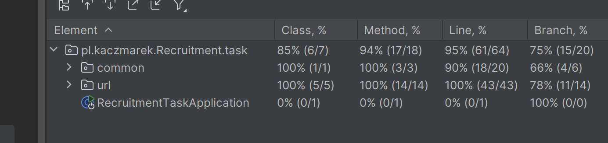

# mercedes-recrutiment-task

Recrutiment task, REST API in Java and Spring boot.

## Requirements

For building and running the application you need:

- [JDK 21](https://www.oracle.com/pl/java/technologies/downloads/)
- [Maven 3](https://maven.apache.org)

## Running the application locally


```shell
mvn spring-boot:run
```

## Running in docker container


```shell
docker compose up -d --build
```

## H2 Database url
http://localhost:8080/h2-console

## Code coverage

> score>85%


## Copyright

No copyright allowed. 


